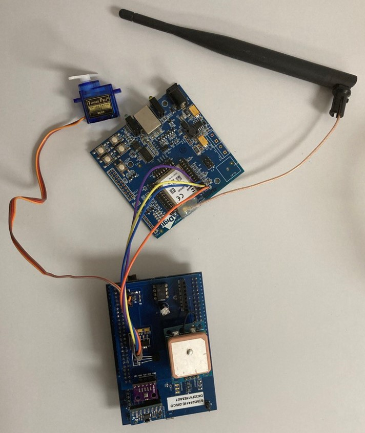
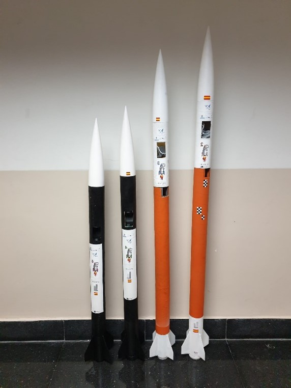

# Trabajo-SED-STM32

Trabajo-SED-STM32

Sistemas Electrónicos Digitales  
Trabajo STM32 23/24  

Authors:  
Pablo Nuñez Hernández (54773)  
Sara de Vargas Muller (53919)  
Andrés Fernández Muñoz (55237)  

Devices list:  

BUTTON ON/OF	Grabación de datos  
GPS		Andres  
SERVO		Andres  
SD -> SDIO	Andres  
EEPROM I2C	Andres  
PRESION BMP280	Andres  
Acc/Gyr		Pablo & Sara  
Temperatura	Pablo & Sara  
DHT11		Pablo & Sara  
TELEM(UART)	Pablo & Sara  
ZUMBADOR	Pablo & Sara  
LED		Pablo & Sara  

Montaje

 

Rockets

 

